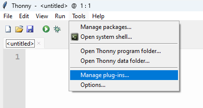
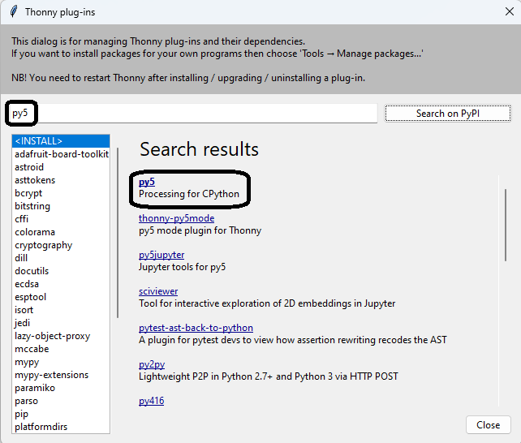
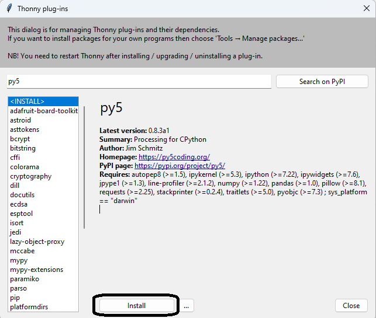

## Install Py5 for Thonny

 - From the **Tools** menu select **Manage plug-ins...**

 

 - Use the search feature to find the Py5 plug-in.

 

 - Select **Py5** from the search results, and then click on the install button.

 

 - After a fe minutes, the Py5 plug-in will be installed and available to use.